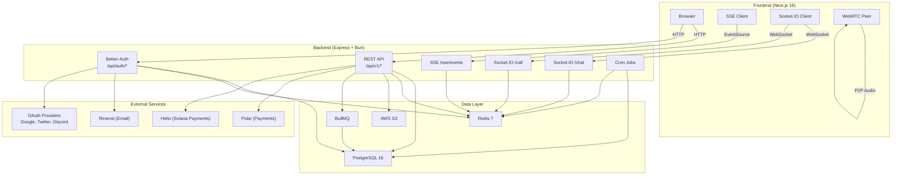
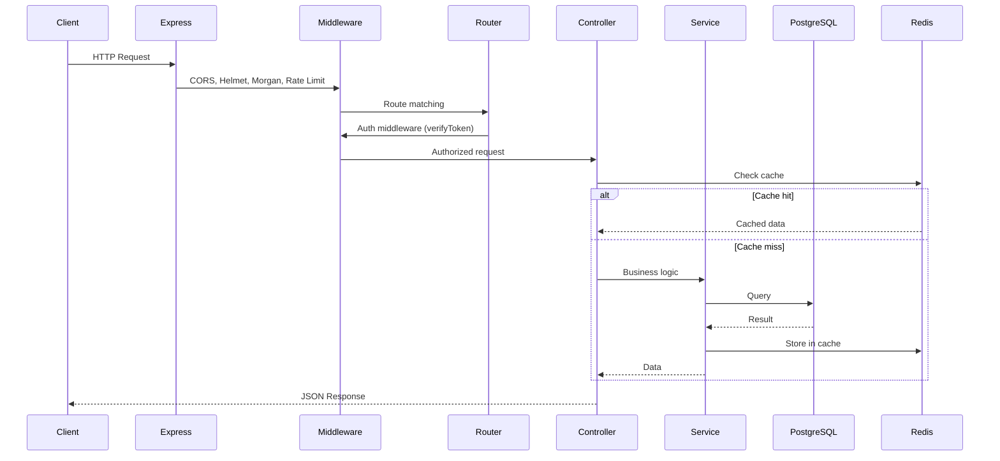
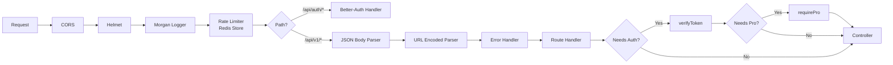
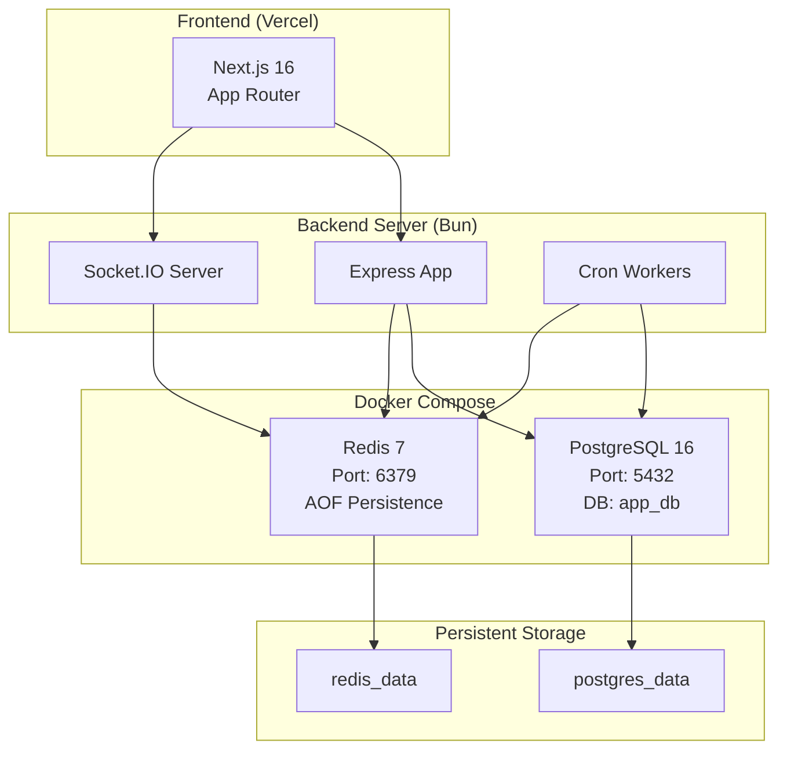
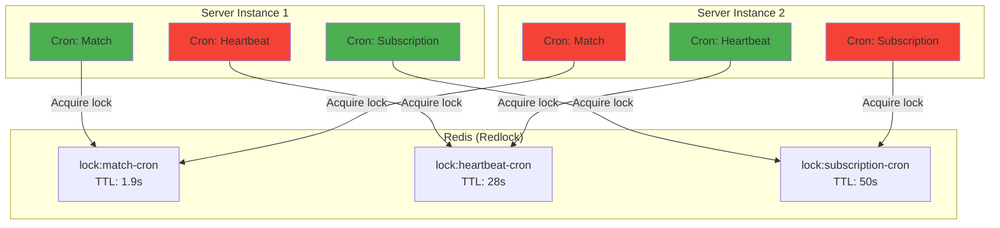
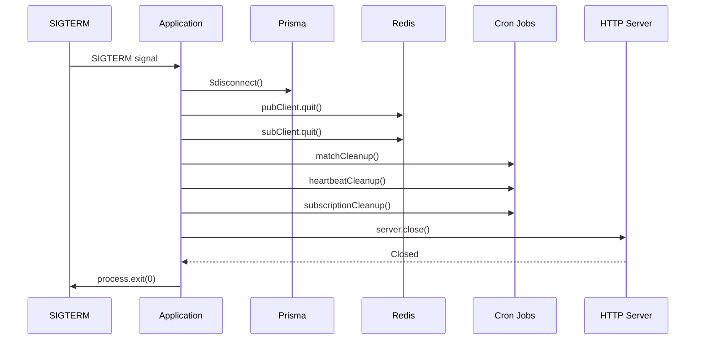

# Architecture

## System Overview

## Request Flow

## Middleware Pipeline

## Infrastructure

## Redis Usage Patterns

Redis serves multiple roles in the architecture:

| Pattern | Usage | Key Format |
|---------|-------|-----------|
| **Cache** | API response caching (TTL-based) | `cache:{resource}:{id}` |
| **Pub/Sub** | Real-time notifications via SSE | `sse:user:{userId}` |
| **ZSET** | Available user pool for matching | `available:{type}:users` |
| **ZSET** | Interest-based user indexing | `available:{type}:interest:{interest}` |
| **Hash** | User metadata during search | `available:{type}:user:{userId}` |
| **List** | Friend chat message storage | `friend-chat:{roomId}:messages` |
| **List** | Call queue for WebRTC pairing | `call:queue` |
| **String** | Room state / heartbeat tracking | `room-state:{roomId}` |
| **String** | Match data (JWT, room info) | `match:{userId}` |
| **String** | Rate limiter counters | `rl:{ip}` |
| **Adapter** | Socket.IO horizontal scaling | Internal Socket.IO channels |
| **Redlock** | Distributed cron job locking | `lock:{cronName}` |
| **Store** | Better-Auth session storage | `auth:session:{token}` |

## Distributed Execution

Only one instance wins each lock. Others skip execution, preventing duplicate processing.

## Rate Limiting

- **Window**: 5 minutes (configurable via `RATE_LIMIT_WINDOW_MS`)
- **Max Requests**: 300 per window (configurable via `RATE_LIMIT_MAX`)
- **Store**: Redis-backed for distributed consistency
- **Headers**: Standard rate limit headers (`RateLimit-*`)

## Graceful Shutdown

