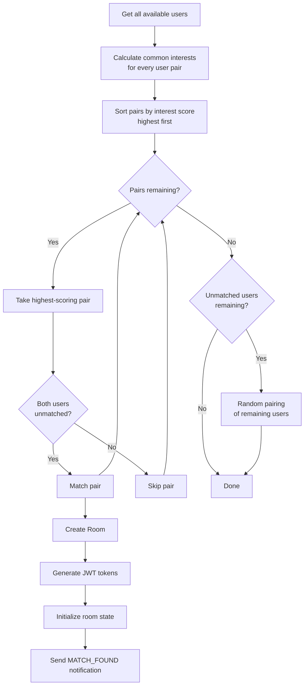
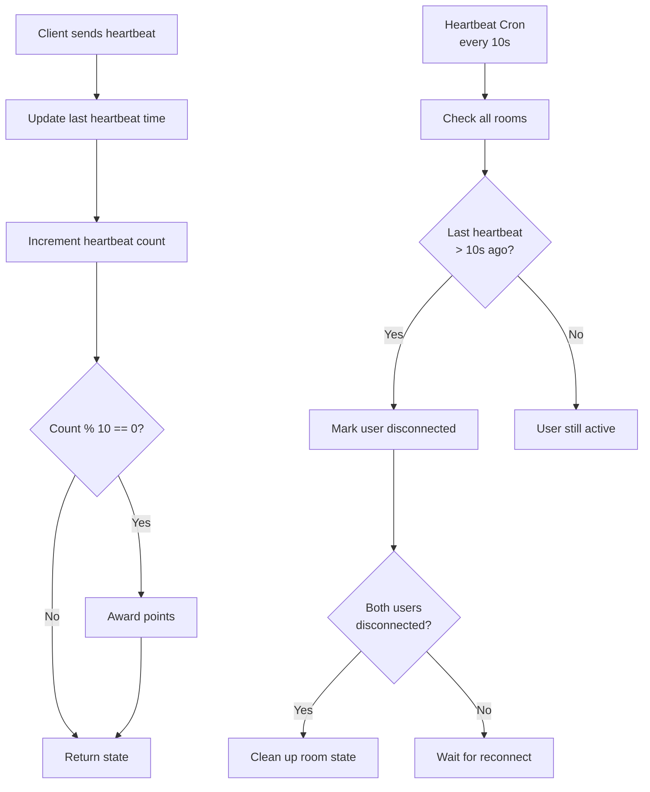

# Backend Architecture

## Overview

The backend is a Bun-powered Express.js application with Socket.IO for real-time communication, Prisma ORM for PostgreSQL, Redis for caching/pub-sub, and BullMQ for job processing.

**Entry point**: `cashual-backend/src/index.ts`

## Service Layer

All business logic is encapsulated in service classes under `cashual-backend/src/service/`.

### UserService (`user.service.ts`)

Manages user CRUD and profile operations.

| Method | Description |
|--------|-------------|
| `createUser()` | Creates user, prevents duplicate username/wallet |
| `getUserById()` | Fetches user with friendships and relations |
| `getUserByUsername()` | Searches by username, name, or displayUsername |
| `searchUsersByUsername()` | Partial match search (limit 20) |
| `getAllUsers()` | Fetches all users with relations |
| `updateUser()` | Updates user fields |
| `deleteUser()` | Transaction: deletes all user-related records |
| `toggleBanUser()` | Sets/unsets ban status |
| `checkUsernameAvailability()` | Checks if username is taken |

### MatchService (`match.service.ts`)

Core matching algorithm for pairing users in random chats/calls.

| Method | Description |
|--------|-------------|
| `addUser(userId, interests)` | Adds user to available pool with interests |
| `removeUser(userId)` | Removes from pool |
| `updateUserHeartbeat(userId)` | Updates activity timestamp |
| `cleanupInactiveUsers(timeout)` | Removes users inactive for >30s |
| `bestMatch()` | Runs matching algorithm (see diagram above) |
| `setMatch(user1, user2)` | Creates room, tokens, notifications |
| `getMatchedJWT(userId)` | Retrieves match data from Redis |

**Anti-duplicate**: 7-second cooldown between re-matches of the same pair.

### AvailableUserService (`available-user.service.ts`)

Manages the Redis-backed pool of users searching for matches.

**Redis data structures used:**
- `available:{type}:users` — ZSET of user IDs (score = timestamp)
- `available:{type}:interest:{interest}` — ZSET of users with that interest
- `available:{type}:user:{userId}` — Hash with user metadata
- `presence:{type}` — String counter for SSE user count

| Method | Description |
|--------|-------------|
| `addUser(id, interests)` | Adds to ZSET + interest ZSETs + metadata hash |
| `removeUser(id)` | Removes from all data structures |
| `getAvailableUsers()` | Returns all users in pool with interests |
| `getCommonInterests(u1, u2)` | Calculates interest overlap count |
| `incrementPresence()` | Increments online counter |
| `decrementPresence()` | Decrements online counter |
| `getUserCount()` | Returns online user count |
| `isUserOnline(userId)` | Checks active SSE connections |
| `cleanupDataTypeInconsistencies()` | Converts legacy SETs to ZSETs |

### FriendService (`friend.service.ts`)

Friend request and friendship management with aggressive Redis caching.

**Cache TTLs:**
- Friends list: 5 minutes
- Friendship status: 10 minutes
- Suggestions: 30 minutes

| Method | Description |
|--------|-------------|
| `getFriendsListById(userId)` | Returns accepted/pending_sent/pending_received |
| `sendFriendRequest(userId, friendId)` | Creates request; auto-accepts if bidirectional |
| `acceptFriendRequest(friendshipId)` | Marks as accepted, sends notification |
| `rejectFriendRequest(friendshipId)` | Deletes friendship record |
| `removeFriend(userId, friendId)` | Deletes any friendship |
| `areFriends(userId, friendId)` | Returns boolean + status string |
| `getFriendSuggestions(userId, limit)` | Random users not in friend network |
| `getPendingRequests(userId)` | Incoming requests only |

All mutations invalidate relevant cache keys.

### FriendChatService (`friend-chat.service.ts`)

Manages authenticated friend-to-friend messaging.

| Method | Description |
|--------|-------------|
| `startChat(userId, friendId)` | Creates deterministic room ID, generates 100-year JWT tokens |

### FriendChatMessageService (`friend-chat-message.service.ts`)

Redis-backed message storage for friend chats (max 500 messages per room).

| Method | Description |
|--------|-------------|
| `addMessage(roomId, message)` | Stores in Redis list, auto-trims to 500 |
| `getMessages(roomId, limit)` | Fetches messages (limit 1-500) |

### PointService (`point.service.ts`)

Gamification points tracking and leaderboard management.

| Method | Description |
|--------|-------------|
| `addPoints(userId, points)` | Creates PointActivity record |
| `bulkAddPoints(entries)` | Batch add for multiple users |
| `getPoints(userId, dateRange?)` | Sum of points with optional date filter |
| `getUserPointsByDate(userId)` | Points grouped by date |
| `getLeaderboard()` | Top users ranked by points |
| `getUserAnalytics(userId)` | Daily breakdown and trends |
| `getPointsHistory(period)` | Trends by period (daily/weekly/monthly) |
| `getUserTotalPoints(userId)` | All-time total (cached) |

**Cache TTL**: 300 seconds for points queries.

### RoomService (`room.service.ts`)

Room lifecycle management.

| Method | Description |
|--------|-------------|
| `createRoom(type, user1, user2)` | Creates room record (cached 24hr) |
| `getRoom(roomId)` | Fetches with caching |
| `getRoomByUsers(user1, user2)` | Finds existing room |
| `getLastMessage(roomId)` | Most recent message |
| `getMessages(roomId, pagination)` | Paginated messages |

### RoomStateService (`room-state.service.ts`)

Heartbeat tracking and disconnection detection.

| Method | Description |
|--------|-------------|
| `heartbeat(roomId, userId)` | Updates timestamp, counts, awards points |
| `initializeRoomState(roomId, u1, u2)` | Sets up tracking for new room |
| `makeDisconnect()` | Marks users offline if no heartbeat in 10s |
| `removeDisconnectedUsers()` | Cleans up fully disconnected rooms |

### NotificationService (`notification.service.ts`)

Database + Redis pub/sub notification system.

| Method | Description |
|--------|-------------|
| `createNotification(userId, type, title, message, data, priority)` | Creates DB record + publishes to Redis |
| `deleteNotification(id, userId)` | Deletes notification |
| `sendUnsentNotifications(userId)` | Re-sends unsent notifications on reconnect |

**Delivery flow**: Database insert → Check if user online → Publish to `sse:user:{userId}` Redis channel → SSE endpoint picks up and delivers.

### SubscriptionService (`subscription.service.ts`)

Pro subscription lifecycle.

| Method | Description |
|--------|-------------|
| `checkExpiredSubscriptions()` | Updates isPro=false for expired users |
| `getSubscriptionStats()` | Counts pro users, revenue calculation |
| `isUserSubscriptionActive(userId)` | Checks if proEnd > now |
| `extendSubscription(userId, plan)` | Extends proEnd by plan duration |

### RatingService (`rating.service.ts`)

Post-interaction rating system.

| Method | Description |
|--------|-------------|
| `createOrUpdateRating(userId, ratedUserId, rating)` | Upsert 1-5 rating |
| `getRatingSummaryForUser(userId)` | Average rating and count |
| `getRatingsForUser(userId, pagination)` | Paginated ratings received |
| `getGivenRatings(userId, pagination)` | Paginated ratings given |

### ReportService (`report.service.ts`)

Abuse reporting and moderation.

| Method | Description |
|--------|-------------|
| `createReport(reporterId, reportedUserId, reason)` | Validates, prevents self-reports & duplicates |
| `getAllReports(skip, take, orderBy)` | Paginated list |
| `getReportStats()` | Aggregates: total, today, week, month, top 10 |
| `deleteReport(id)` | Deletes with cache invalidation |

### ChatDBService (`chat-db.service.ts`)

Message persistence layer using BullMQ.

| Method | Description |
|--------|-------------|
| `addMessage(msg)` | Queues via BullMQ for async DB insert |
| `getMessages(roomId)` | Returns DB messages + queued messages merged |
| `addGlobalMessage(msg)` | Stores in Redis list (max 1000) |
| `getGlobalMessages()` | Fetches all global messages |

---

## Cron Jobs

All cron jobs use Redlock for distributed execution.

### Match Cron (`cron/match.cron.ts`)

- **Schedule**: Every 3 seconds
- **Lock TTL**: 1.9 seconds
- **Process**:
  1. Cleanup data type inconsistencies (SET → ZSET)
  2. Remove inactive users (30s timeout)
  3. Run `bestMatch()` for chat pool
  4. Run `bestMatch()` for call pool

### Heartbeat Cron (`cron/heartbeat.cron.ts`)

- **Schedule**: Every 10 seconds
- **Lock TTL**: 28 seconds
- **Process**:
  1. `makeDisconnect()` — mark users offline
  2. `removeDisconnectedUsers()` — clean up rooms

### Subscription Cron (`cron/subscription.cron.ts`)

- **Schedule**: Every hour at :00
- **Lock TTL**: 50 seconds
- **Process**:
  1. `checkExpiredSubscriptions()` — set isPro=false for expired

---

## Middleware

### Auth Middleware (`middleware/auth.middleware.ts`)

- **`verifyToken`**: Extracts JWT from `Authorization: Bearer <token>` header, validates, attaches decoded payload to request
- **`requirePro`**: Checks `user.isPro === true` and `proEnd > now`

### Socket Middleware (`middleware/socket.middleware.ts`)

- **`verifyToken(token)`**: Decodes JWT, extracts `senderId`, `receiverId`, `roomId`, `senderUsername`, `receiverUsername`
- **`generateToken(data, expiry)`**: Creates JWT with room/user data (default 24h expiry)

### Validate Middleware (`middleware/validate.middleware.ts`)

- **`validateResponse`**: Response validation/sanitization wrapper

---

## Authentication (`lib/auth.ts`)

Framework: **Better-Auth v1.5.4**

**Plugins:**
- Magic link (email via Resend)
- Username (profile completion)
- Admin (user management, banning)
- Anonymous (auto-generated usernames via unique-names-generator)
- Polar (subscription integration)

**OAuth Providers**: Google, Twitter, Discord

**Session Config:**
- Expiry: 30 days
- Update frequency: Daily
- Secondary storage: Redis

**Custom User Fields**: `walletAddress`, `isPro`, `gender`, `interests`, `isBanned`, `avatarUrl`, `isAnonymous`, `username`, `displayUsername`

---

## External Integrations

### Polar (`lib/polar.ts`)
Payment processor for Pro subscriptions. Webhook-based flow.

### Resend (`lib/email.tsx`)
Transactional email (magic links). React email templates.

### AWS S3 (`controller/upload.controller.ts`)
Presigned URL generation for avatar/media uploads. 1-hour expiry.

### BullMQ (`lib/queue.ts`)
Job queues: `messageQueue` (chat persistence), `matchQueue` (user matching).
Admin UI at `/admin/queues`.
