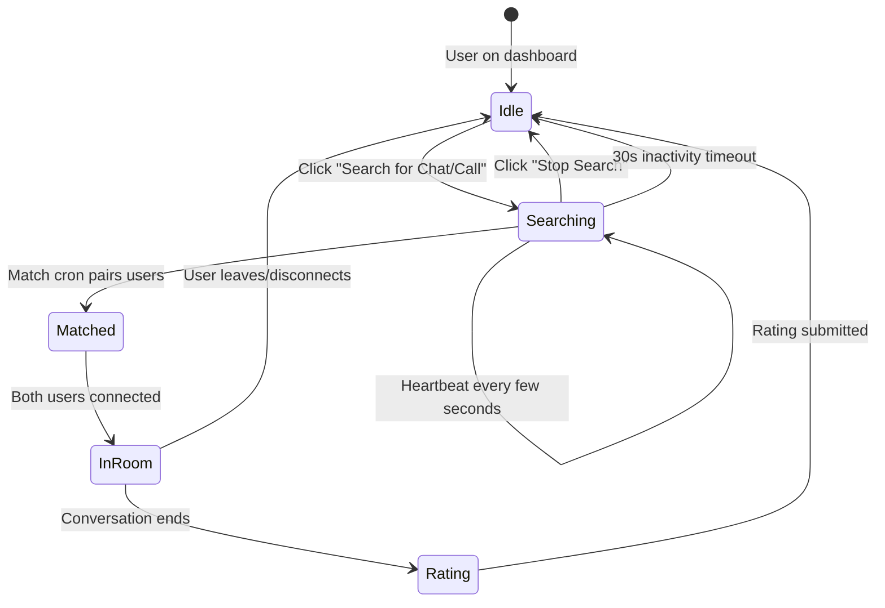
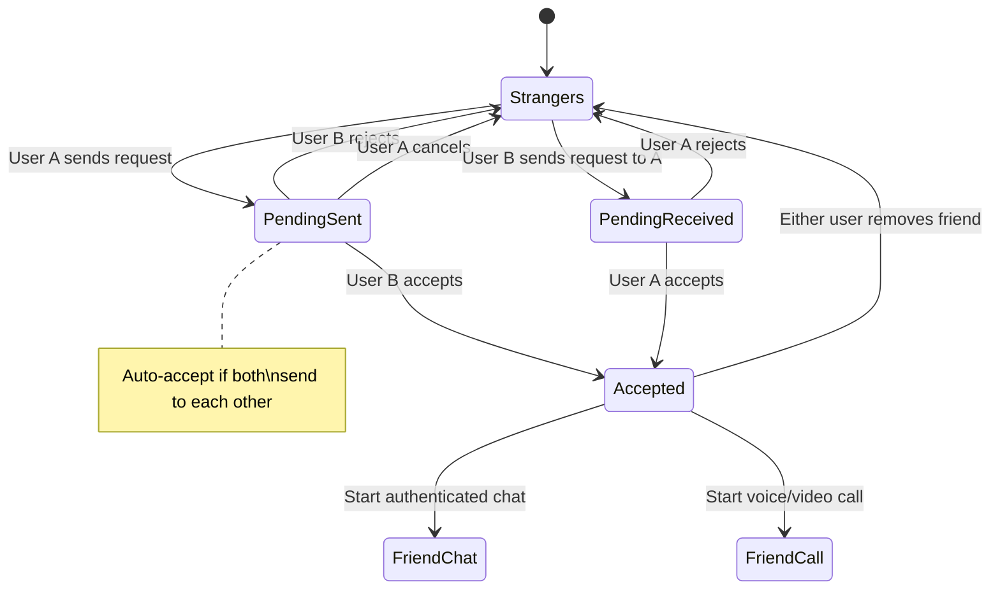
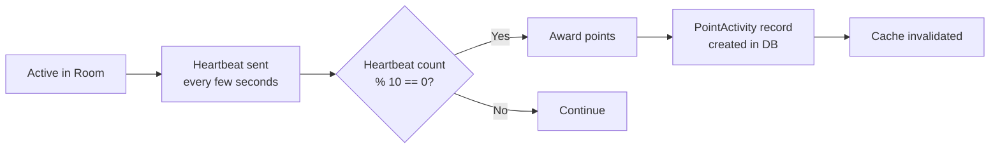
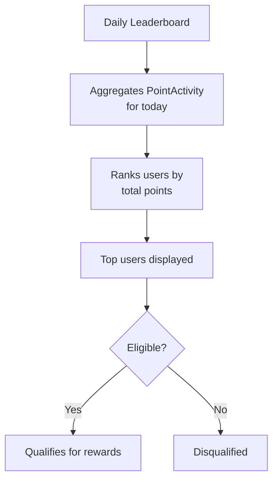
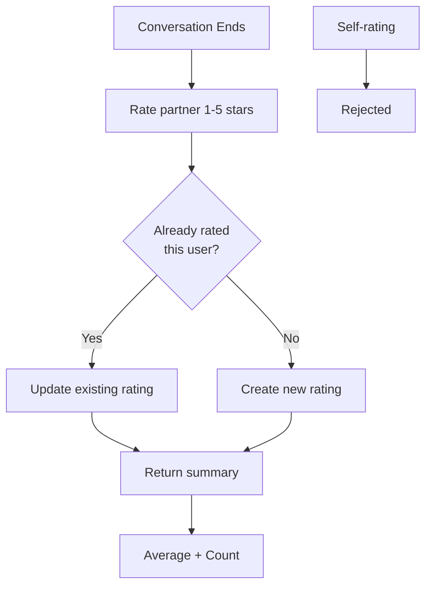
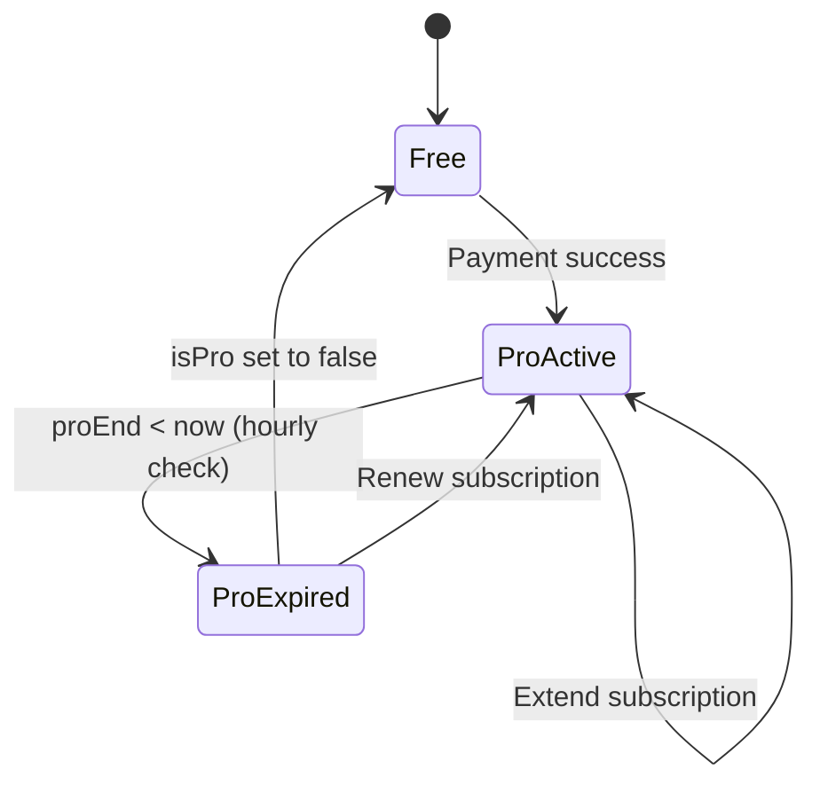
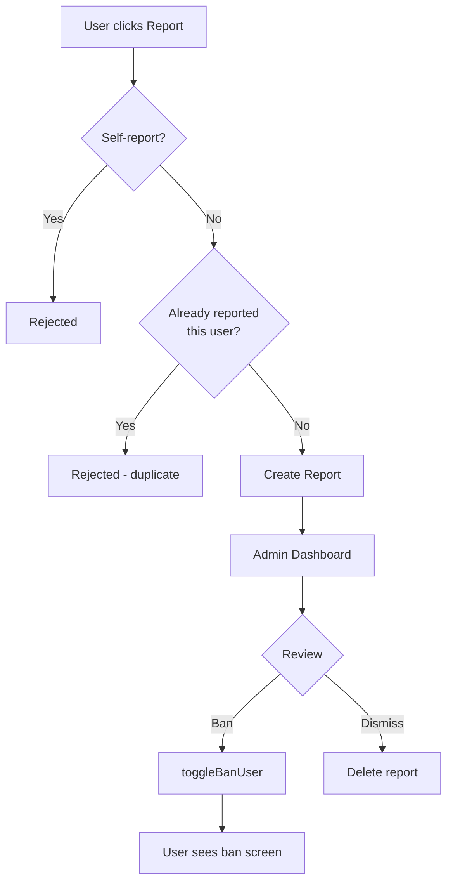
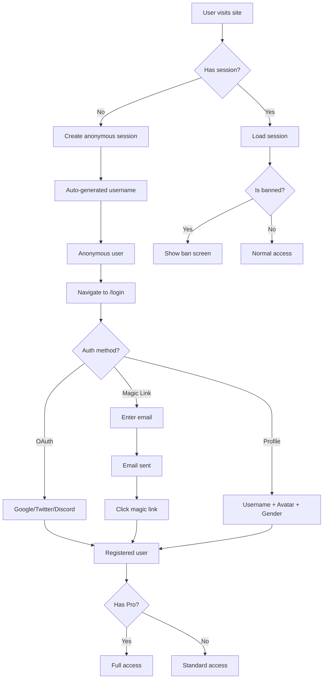
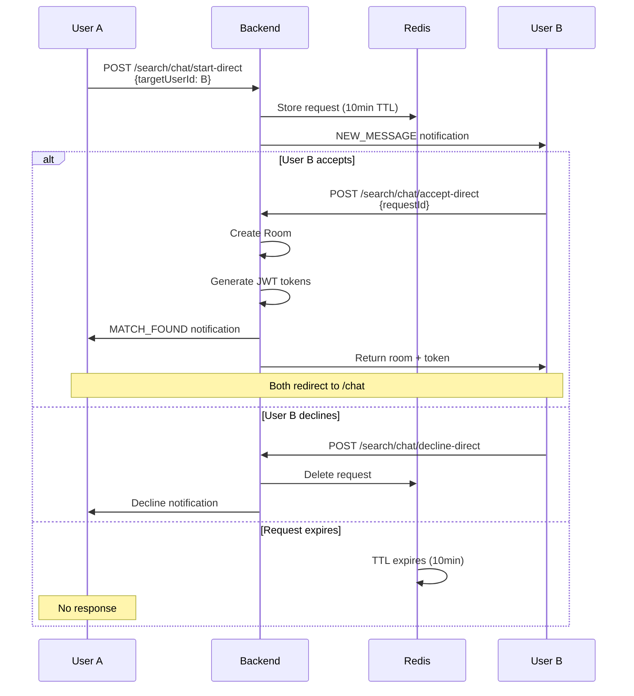

# Business Logic

## Core Features

### 1. Spontaneous Matching

Users are randomly matched 1-on-1 for chat or calls based on shared interests.



**Matching rules:**
- Interest-based scoring (common interests count)
- Greedy highest-score-first pairing
- Random fallback for unmatched users
- 7-second re-match cooldown per pair
- 30-second inactivity removal
- Runs every 3 seconds via cron

### 2. Communication Modes

#### Text Chat
- Real-time via Socket.IO `/chat` namespace
- Supports: text, image, gif, audio, video, file message types
- Reply-to functionality
- Typing indicators
- Messages persisted via BullMQ → PostgreSQL
- Anonymous users supported (via `senderAnonId`)

#### Voice Calls
- WebRTC peer-to-peer audio
- Signaled via Socket.IO `/call` namespace
- SDP offer/answer exchange
- ICE candidate forwarding for NAT traversal
- Audio mixing via Web Audio API (gain nodes per peer)
- Network quality monitoring (Excellent/Good/Poor/Bad)
- Call duration tracking

#### Friend Chat
- Authenticated messaging between accepted friends
- Messages stored in Redis (max 500 per room)
- 100-year JWT tokens (permanent access)
- Deterministic room IDs (sorted usernames)
- Supports reply-to feature

### 3. Friend System



**Auto-accept logic:** If User A sends a request to User B, and User B already has a pending request to User A, both requests are automatically accepted.

**Caching:**
- Friends list: 5-minute TTL
- Friendship status: 10-minute TTL
- Suggestions: 30-minute TTL
- All caches invalidated on mutations

### 4. Points & Leaderboard

#### Point Earning

Points are earned through active participation:



#### Leaderboard



**Scoring formula (displayed on /me page):**
```
Total Daily Points = Base Points × Rating Multiplier
```

- Base points from voice calls and text chats
- Rating multiplier based on average user rating
- One leaderboard entry per user per day (`@@unique([userId, date])`)

#### Lucky Winner

- Daily random reward drawing
- Winner selected from eligible leaderboard participants
- Stored in `LuckyWinnerEntry` table
- Cached for 2 hours

### 5. Rating System



**Constraints:**
- 1-5 star scale
- Self-rating prevented
- Upsert behavior (one rating per user pair, overwritten on re-rate)
- Summary: average rating + total count

### 6. Subscription System



**Plans:**
| Plan | Price | Duration |
|------|-------|----------|
| Weekly | $0.99 | 7 days |
| Monthly | $2.99 | 30 days |
| Annually | $29.99 | 365 days |

**Payment flow:**
1. User selects plan on `/pricing`
2. Redirected to Polar/Helio checkout
3. On success: `POST /api/v1/payment/success`
4. Backend: sets `isPro=true`, calculates `proEnd`, creates `Subscription` record
5. Webhook for server-side verification (Helio)

**Expiration:**
- Cron runs hourly
- Checks all users where `isPro=true AND proEnd < now`
- Sets `isPro=false` for expired users

**Pro-only features:**
- Chat/call history access (`requirePro` middleware)
- Smart matching filters (gender, region)
- Ad-free experience
- Priority queue access
- Pro badge

### 7. Notification System

```mermaid
flowchart TD
    A[Event occurs] --> B[NotificationService.createNotification]
    B --> C[Insert into PostgreSQL]
    C --> D{User online?}
    D -->|Yes| E[Publish to Redis<br/>sse:user:{userId}]
    E --> F[SSE endpoint<br/>delivers to client]
    D -->|No| G[Stored as unsent]
    G --> H[User reconnects]
    H --> I[sendUnsentNotifications]
    I --> F
    F --> J[useNotification hook<br/>handles by type]
    J --> K{Type?}
    K -->|MATCH_FOUND| L[Redirect to chat/call]
    K -->|FRIEND_REQUEST| M[Toast + refetch]
    K -->|NEW_MESSAGE| N[Alert with accept/decline]
    K -->|CALL_INCOMING| O[Call dialog]
    K -->|Others| P[Toast notification]
```

**Priority levels:**
- `LOW` — background info
- `NORMAL` — standard notifications
- `HIGH` — urgent (incoming calls, etc.)

### 8. Reporting & Moderation



**Admin capabilities:**
- View all reports (paginated)
- Report statistics (total, today, week, month, top 10 reported)
- Ban/unban users
- Ban reason and expiration date
- User management (create, view, modify roles)

### 9. Authentication Flow



### 10. Direct Chat



### 11. Invite System

Users can invite others via a link containing an invite code:

1. Invite link: `/invite?code=<invite_code>&type=chat|call`
2. Invite page processes the code
3. Sets up room, token, and user IDs in chat store
4. Redirects to `/chat` or `/call` based on type

### 12. Global Chat

- Public chat visible to all users
- No authentication required to read
- Messages stored in Redis list (max 1000)
- Endpoint: `GET /api/v1/history/global-chats`

---

## Anti-Fraud Mechanisms

1. **Heartbeat verification** — users must actively participate (heartbeat every few seconds)
2. **Inactivity timeout** — 30-second removal from matching pool
3. **Disconnection detection** — 10-second heartbeat timeout marks users offline
4. **Rate limiting** — 300 requests per 5-minute window (Redis-backed)
5. **Distributed locking** — prevents duplicate cron job execution
6. **Self-action prevention** — cannot self-rate, self-report, or self-friend
7. **Duplicate prevention** — no duplicate reports or friend requests

---

## Caching Strategy

| Resource | TTL | Invalidation |
|----------|-----|-------------|
| Friends list | 5 min | On any friend mutation |
| Friendship status | 10 min | On accept/reject/remove |
| Friend suggestions | 30 min | On friend mutation |
| Points queries | 300s | On point addition |
| Leaderboard | 300s | On point changes |
| User search results | 300s | Time-based |
| Avatars | 3600s | Time-based |
| Reports (single) | 3600s | On delete |
| Reports (list) | 3600s | On create/delete |
| Lucky winner | 7200s | Time-based |
| Room data | 24 hours | Time-based |
