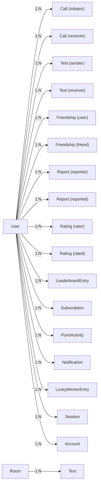

# Database Schema

## Entity Relationship Diagram (Mermaid)

```mermaid
erDiagram
    User ||--o{ Call : "initiates"
    User ||--o{ Call : "receives"
    User ||--o{ Text : "sends"
    User ||--o{ Text : "receives"
    User ||--o{ Friendship : "has"
    User ||--o{ Friendship : "is friend of"
    User ||--o{ Report : "reports"
    User ||--o{ Report : "is reported"
    User ||--o{ LeaderboardEntry : "has entries"
    User ||--o{ Subscription : "subscribes"
    User ||--o{ PointActivity : "earns points"
    User ||--o{ Rating : "rates"
    User ||--o{ Rating : "is rated"
    User ||--o{ Notification : "receives"
    User ||--o{ LuckyWinnerEntry : "wins"
    User ||--o{ Session : "has sessions"
    User ||--o{ Account : "has accounts"
    Room ||--o{ Text : "contains"

    User {
        uuid id PK
        string name
        string email UK
        string username UK
        string displayUsername
        string walletAddress
        string gender
        string ipAddress
        string avatarUrl
        string image
        string[] interests
        boolean isPro
        datetime proEnd
        boolean isBanned
        boolean banned
        string banReason
        datetime banExpires
        string role
        boolean isAnonymous
        boolean emailVerified
        datetime createdAt
        datetime updatedAt
    }

    Call {
        uuid id PK
        string initiatorId FK
        string receiverId FK
        int durationSec
        datetime startedAt
        datetime endedAt
        int ratedByInitiator
        int ratedByReceiver
    }

    Text {
        uuid id PK
        string senderId FK
        string receiverId FK
        string senderAnonId
        string receiverAnonId
        string content
        datetime sentAt
        string roomId FK
    }

    Room {
        uuid id PK
        enum type
        string user1Id
        string anonUser1Id
        string user2Id
        string anonUser2Id
        datetime createdAt
        datetime updatedAt
    }

    Friendship {
        uuid id PK
        string userId FK
        string friendId FK
        boolean accepted
        datetime createdAt
    }

    Report {
        uuid id PK
        string reporterId FK
        string reportedUserId FK
        string reason
        datetime createdAt
    }

    Rating {
        uuid id PK
        string userId FK
        string ratedUserId FK
        int rating
        datetime createdAt
    }

    LeaderboardEntry {
        uuid id PK
        string userId FK
        datetime date
        float score
        boolean eligible
    }

    LuckyWinnerEntry {
        uuid id PK
        string userId FK
        datetime createdAt
    }

    Subscription {
        uuid id PK
        string userId FK
        enum plan
        datetime startedAt
        datetime expiresAt
        string paymentId UK
    }

    PointActivity {
        uuid id PK
        string userId FK
        int point
        datetime createdAt
    }

    Notification {
        uuid id PK
        string userId FK
        enum type
        string title
        string message
        json data
        boolean isSent
        datetime createdAt
        datetime sentAt
        datetime readAt
        enum priority
    }

    Session {
        string id PK
        datetime expiresAt
        string token UK
        string ipAddress
        string userAgent
        string userId FK
        string impersonatedBy
        datetime createdAt
        datetime updatedAt
    }

    Account {
        string id PK
        string accountId
        string providerId
        string userId FK
        string accessToken
        string refreshToken
        string idToken
        datetime accessTokenExpiresAt
        datetime refreshTokenExpiresAt
        string scope
        string password
        datetime createdAt
        datetime updatedAt
    }

    Verification {
        string id PK
        string identifier
        string value
        datetime expiresAt
        datetime createdAt
        datetime updatedAt
    }
```



## DBML Schema

```dbml
// Cashual Database Schema
// Compatible with dbdiagram.io

Table User [headercolor: #3b82f6] {
  id uuid [pk, default: `uuid()`]
  name varchar [not null]
  email varchar [unique, not null]
  username varchar [unique]
  displayUsername varchar
  walletAddress varchar
  gender varchar
  ipAddress varchar
  avatarUrl varchar
  image varchar
  interests varchar[] [note: 'Array of interest tags']
  isPro boolean [default: false]
  proEnd timestamp [note: 'Pro subscription end date']
  isBanned boolean [default: false]
  banned boolean [default: false]
  banReason varchar
  banExpires timestamp
  role varchar [default: 'user', note: 'user | admin']
  isAnonymous boolean
  emailVerified boolean [default: false]
  createdAt timestamp [default: `now()`]
  updatedAt timestamp

  Note: 'Core user entity. Supports anonymous, registered, and pro tiers.'
}

Table Call [headercolor: #10b981] {
  id uuid [pk, default: `uuid()`]
  initiatorId uuid [ref: > User.id, note: 'User who started the call']
  receiverId uuid [ref: > User.id, note: 'User who was matched']
  durationSec int [not null]
  startedAt timestamp [not null]
  endedAt timestamp [not null]
  ratedByInitiator int [note: '1-5 stars, nullable']
  ratedByReceiver int [note: '1-5 stars, nullable']

  Note: 'Voice call records between two users.'
}

Table Text [headercolor: #8b5cf6] {
  id uuid [pk, default: `uuid()`]
  senderId uuid [ref: > User.id, note: 'Nullable for anonymous']
  receiverId uuid [ref: > User.id, note: 'Nullable for anonymous']
  senderAnonId varchar [not null, note: 'Anon tracking ID for sender']
  receiverAnonId varchar [not null, note: 'Anon tracking ID for receiver']
  content text [not null]
  sentAt timestamp [default: `now()`]
  roomId uuid [ref: > Room.id, not null]

  Note: 'Chat messages. Supports both authenticated and anonymous users via dual ID fields.'
}

Table Room [headercolor: #f59e0b] {
  id uuid [pk, default: `uuid()`]
  type RoomType [not null, note: 'CHAT | CALL | VIDEO_CALL']
  user1Id uuid [note: 'Authenticated user 1']
  anonUser1Id varchar [note: 'Fallback for anonymous user 1']
  user2Id uuid [note: 'Authenticated user 2']
  anonUser2Id varchar [note: 'Fallback for anonymous user 2']
  createdAt timestamp [default: `now()`]
  updatedAt timestamp

  indexes {
    user1Id
    user2Id
    anonUser1Id
    anonUser2Id
  }

  Note: 'Communication rooms. Each room has exactly 2 participants (auth or anon).'
}

Table Friendship [headercolor: #ec4899] {
  id uuid [pk, default: `uuid()`]
  userId uuid [ref: > User.id, not null]
  friendId uuid [ref: > User.id, not null]
  accepted boolean [default: false, note: 'true = confirmed friends']
  createdAt timestamp [default: `now()`]

  indexes {
    (userId, friendId) [unique, note: 'One friendship record per pair']
  }

  Note: 'Friend requests and accepted friendships. Cascade delete on user removal.'
}

Table Report [headercolor: #ef4444] {
  id uuid [pk, default: `uuid()`]
  reporterId uuid [ref: > User.id, not null]
  reportedUserId uuid [ref: > User.id, not null]
  reason text [not null]
  createdAt timestamp [default: `now()`]

  Note: 'User abuse reports. Self-reports and duplicates are prevented at the service layer.'
}

Table Rating [headercolor: #06b6d4] {
  id uuid [pk, default: `uuid()`]
  userId uuid [ref: > User.id, not null, note: 'User giving the rating']
  ratedUserId uuid [ref: > User.id, not null, note: 'User being rated']
  rating int [not null, note: '1-5 stars']
  createdAt timestamp [default: `now()`]

  Note: 'Post-interaction ratings. Self-ratings prevented. Upsert behavior (create or update).'
}

Table LeaderboardEntry [headercolor: #84cc16] {
  id uuid [pk, default: `uuid()`]
  userId uuid [ref: > User.id, not null]
  date timestamp [not null, note: 'Date of the leaderboard entry']
  score float [not null]
  eligible boolean [default: true, note: 'false = disqualified from rewards']

  indexes {
    (userId, date) [unique, note: 'One entry per user per day']
  }

  Note: 'Daily leaderboard scores. Resets daily.'
}

Table LuckyWinnerEntry [headercolor: #f97316] {
  id uuid [pk, default: `uuid()`]
  userId uuid [ref: > User.id, not null]
  createdAt timestamp [default: `now()`]

  Note: 'Lucky winner reward pool entries.'
}

Table Subscription [headercolor: #a855f7] {
  id uuid [pk, default: `uuid()`]
  userId uuid [ref: > User.id, not null]
  plan Plan [not null, note: 'MONTHLY | YEARLY']
  startedAt timestamp [default: `now()`]
  expiresAt timestamp [not null]
  paymentId varchar [unique, note: 'External payment reference']

  Note: 'Pro subscription records. Expiration checked hourly by cron.'
}

Table PointActivity [headercolor: #14b8a6] {
  id uuid [pk, default: `uuid()`]
  userId uuid [ref: > User.id, not null]
  point int [not null, note: 'Points earned (can be negative for deductions)']
  createdAt timestamp [default: `now()`]

  Note: 'Points ledger. Each record is a point transaction. Aggregated for leaderboard.'
}

Table Notification [headercolor: #6366f1] {
  id uuid [pk, default: `uuid()`]
  userId uuid [ref: > User.id, not null]
  type NotificationType [not null]
  title varchar [not null]
  message varchar [not null]
  data json [note: 'Additional notification payload']
  isSent boolean [default: false]
  createdAt timestamp [default: `now()`]
  sentAt timestamp
  readAt timestamp
  priority NotificationPriority [default: 'NORMAL']

  indexes {
    userId
    createdAt
  }

  Note: 'User notifications. Delivered via SSE + Redis pub/sub. Unsent notifications retried on reconnect.'
}

Table Session [headercolor: #78716c] {
  id varchar [pk]
  expiresAt timestamp [not null]
  token varchar [unique, not null]
  ipAddress varchar
  userAgent varchar
  userId uuid [ref: > User.id, not null]
  impersonatedBy varchar [note: 'Admin impersonation tracking']
  createdAt timestamp [default: `now()`]
  updatedAt timestamp

  indexes {
    userId
  }

  Note: 'Better-Auth sessions. 30-day expiry, daily refresh.'
}

Table Account [headercolor: #78716c] {
  id varchar [pk]
  accountId varchar [not null]
  providerId varchar [not null, note: 'google | twitter | discord | credential']
  userId uuid [ref: > User.id, not null]
  accessToken varchar
  refreshToken varchar
  idToken varchar
  accessTokenExpiresAt timestamp
  refreshTokenExpiresAt timestamp
  scope varchar
  password varchar
  createdAt timestamp [default: `now()`]
  updatedAt timestamp

  indexes {
    userId
  }

  Note: 'OAuth provider accounts linked to users.'
}

Table Verification [headercolor: #78716c] {
  id varchar [pk]
  identifier varchar [not null, note: 'Email or phone for magic link']
  value varchar [not null, note: 'Verification code/token']
  expiresAt timestamp [not null]
  createdAt timestamp [default: `now()`]
  updatedAt timestamp

  indexes {
    identifier
  }

  Note: 'Magic link and email verification tokens.'
}

// Enums

Enum RoomType {
  CHAT
  CALL
  VIDEO_CALL
}

Enum Plan {
  MONTHLY
  YEARLY
}

Enum NotificationType {
  FRIEND_REQUEST
  FRIEND_ACCEPTED
  NEW_MESSAGE
  CALL_INCOMING
  CALL_MISSED
  SYSTEM_ANNOUNCEMENT
  POINTS_EARNED
  ACHIEVEMENT_UNLOCKED
  SUBSCRIPTION_EXPIRING
  SUBSCRIPTION_EXPIRED
  MATCH_FOUND
}

Enum NotificationPriority {
  LOW
  NORMAL
  HIGH
}
```

## Model Relationships



## Key Constraints

| Model | Constraint | Type |
|-------|-----------|------|
| User | `email` | Unique |
| User | `username` | Unique |
| Friendship | `(userId, friendId)` | Unique composite |
| LeaderboardEntry | `(userId, date)` | Unique composite |
| Subscription | `paymentId` | Unique |
| Session | `token` | Unique |

## Indexes

| Model | Indexed Fields | Purpose |
|-------|---------------|---------|
| Room | `user1Id` | Fast room lookup by user |
| Room | `user2Id` | Fast room lookup by user |
| Room | `anonUser1Id` | Fast room lookup by anonymous user |
| Room | `anonUser2Id` | Fast room lookup by anonymous user |
| Notification | `userId` | Fast notification fetch per user |
| Notification | `createdAt` | Chronological ordering |
| Session | `userId` | Fast session lookup per user |
| Account | `userId` | Fast account lookup per user |
| Verification | `identifier` | Fast verification lookup |

## Cascade Deletes

| Parent | Child | On Delete |
|--------|-------|-----------|
| User | Session | Cascade |
| User | Account | Cascade |
| User | Friendship (both sides) | Cascade |

## Anonymous User Support

The `Text` and `Room` models support anonymous users through dual ID fields:

- **Text**: `senderId` (FK to User, nullable) + `senderAnonId` (string, required)
- **Room**: `user1Id` (FK to User, nullable) + `anonUser1Id` (string, nullable)

This allows:
1. Anonymous users to chat without accounts
2. Messages to be tracked by anonymous IDs
3. Later association with real accounts if user registers
