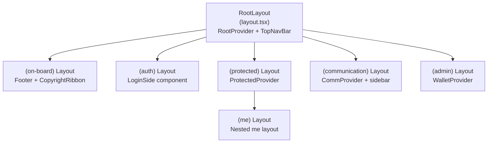
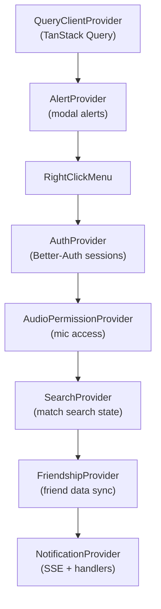
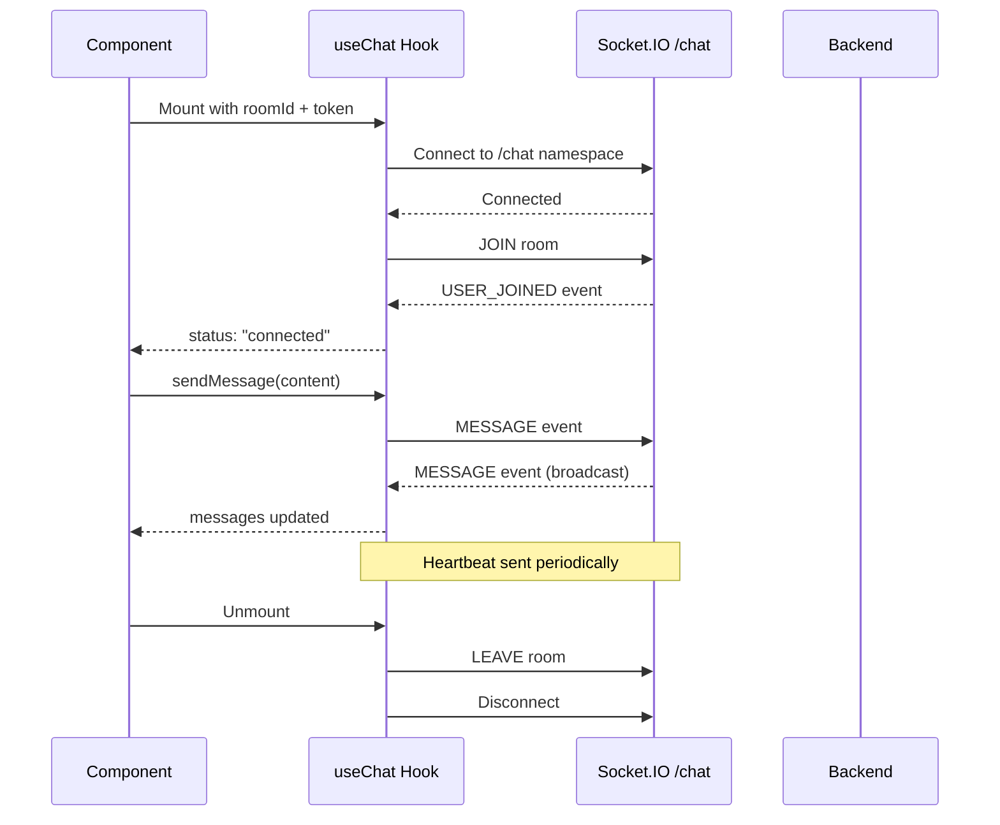
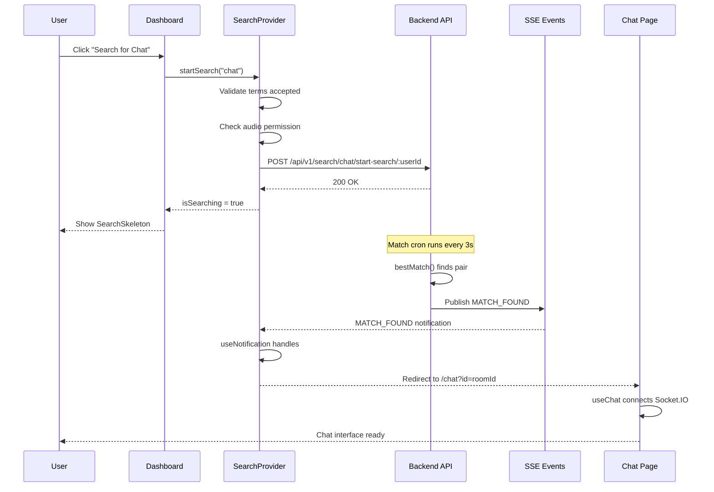

# Frontend Architecture

## Overview

The frontend is a Next.js 16 application using the App Router (React 19), Zustand for state management, TanStack Query for data fetching, and Socket.IO + SSE for real-time communication.

**Entry point**: `cashual-frontend/src/app/layout.tsx`

## Route Structure

```mermaid
graph TD
    Root["/ (Root Layout)"]
    Root --> OnBoard["(on-board) Group"]
    Root --> Auth["(auth) Group"]
    Root --> Protected["(protected) Group"]
    Root --> Comm["(communication) Group"]
    Root --> Admin["(admin) Group"]

    OnBoard --> Home["/ Homepage"]
    OnBoard --> Pricing["/pricing"]
    OnBoard --> Leaderboard["/leaderboard"]
    OnBoard --> Blogs["/blogs"]
    OnBoard --> BlogSlug["/blogs/[slug]"]
    OnBoard --> Markdown["(markdown) Group"]
    Markdown --> Privacy["/privacy-policy"]
    Markdown --> Refund["/refund-policy"]
    Markdown --> Terms["/terms-of-service"]
    Markdown --> Guidelines["/community-guidelines"]
    Markdown --> About["/about"]
    Markdown --> Contact["/contact"]
    Markdown --> Docs["/docs"]

    Auth --> Login["/login"]

    Protected --> Me["/me"]
    Protected --> Settings["/me/settings"]
    Protected --> Friends["/friends"]
    Protected --> PaySuccess["/payment/success"]
    Protected --> PayFailed["/payment/failed"]

    Comm --> Dashboard["/dashboard"]
    Comm --> Chat["/chat"]
    Comm --> Call["/call"]
    Comm --> Invite["/invite"]

    Admin --> AdminDash["/admin"]
    Admin --> Users["/users"]
    Admin --> Live["/live"]
```



## Pages

### Public Pages (on-board)

| Route | File | Description |
|-------|------|-------------|
| `/` | `(on-board)/page.tsx` | Landing page: Hero, MatchVibe, leaderboard table, features, rewards |
| `/pricing` | `(on-board)/pricing/page.tsx` | Pricing cards (Weekly/Monthly/Annual) with feature comparison |
| `/leaderboard` | `(on-board)/leaderboard/page.tsx` | Live leaderboard table (non-mock data) |
| `/blogs` | `(on-board)/blogs/page.tsx` | Blog grid fetched from Strapi CMS |
| `/blogs/[slug]` | `(on-board)/blogs/[slug]/page.tsx` | Individual blog post (MDX rendered) |
| `/privacy-policy` | `(on-board)/(markdown)/privacy-policy/page.tsx` | Privacy policy |
| `/terms-of-service` | `(on-board)/(markdown)/terms-of-service/page.tsx` | Terms of service |
| `/community-guidelines` | `(on-board)/(markdown)/community-guidelines/page.tsx` | Community guidelines |
| `/about` | `(on-board)/(markdown)/about/page.tsx` | About page |
| `/contact` | `(on-board)/(markdown)/contact/page.tsx` | Contact page |

### Authentication

| Route | File | Description |
|-------|------|-------------|
| `/login` | `(auth)/login/page.tsx` | Profile setup: avatar selector, username, gender, wallet, terms |

**Login flow:**
1. User arrives (auto-anonymous session via AuthProvider)
2. Navigate to `/login`
3. Complete profile: choose avatar, enter username, select gender, optional wallet
4. OAuth options: Google, Twitter, Discord
5. Magic link option: email-based sign-in
6. Form validated with Zod schema (`profileSchema`)

### Protected Pages

| Route | File | Description |
|-------|------|-------------|
| `/me` | `(protected)/me/page.tsx` | Dashboard: TopCard, ActivityChart, points formula explanation |
| `/me/settings` | `(protected)/me/settings/page.tsx` | Tabs: Profile, Security, Billing |
| `/friends` | `(protected)/friends/page.tsx` | Friend management: pending/sent/accepted with search |
| `/payment/success` | `(protected)/payment/success/page.tsx` | Animated success with session ID |
| `/payment/failed` | `(protected)/payment/failed/page.tsx` | Animated failure with retry option |

### Communication Pages

| Route | File | Description |
|-------|------|-------------|
| `/dashboard` | `(communication)/dashboard/page.tsx` | Search launcher for call or chat |
| `/chat` | `(communication)/chat/page.tsx` | Chat UI with room from query params |
| `/call` | `(communication)/call/page.tsx` | Call UI: profiles, duration, chat sidebar, network quality, debug panel |
| `/invite` | `(communication)/invite/page.tsx` | Processes invite codes, redirects to chat/call |

### Admin Pages

| Route | File | Description |
|-------|------|-------------|
| `/admin` | `(admin)/admin/page.tsx` | Stats: total users, active, winnings, top performers |
| `/users` | `(admin)/users/page.tsx` | User management: create, ban/unban, role display |
| `/live` | `(admin)/live/page.tsx` | Placeholder for live statistics |

---

## Layout Hierarchy



---

## Providers

Providers are nested in `RootProvider` and provide app-wide context.



### AuthProvider (`provider/auth-provider.tsx`)

- Auto-creates anonymous session on first visit
- Monitors ban status (shows ban screen if banned)
- Provides `useSession()` hook for all components

### SearchProvider (`provider/search-provider.tsx`)

- Manages `isSearching` and `searchType` ("chat" | "call") state
- `startSearch()`: validates terms acceptance, checks audio permission, calls API
- `stopSearch()`: cancels active search
- Shows gender selector and terms acceptance modals

### FriendshipProvider (`provider/friendship-provider.tsx`)

- Fetches friendship status every 60 seconds
- Provides: `acceptFriendRequest()`, `rejectFriendRequest()`, `refetch()`
- Updates Zustand friend store on data changes

### NotificationProvider (`provider/notification-provider.tsx`)

- Establishes SSE connection for real-time notifications
- Routes notifications to `useNotification` hook for type-specific handling

### ProtectedProvider (`provider/protected-provider.tsx`)

- Requires non-anonymous authenticated user
- Shows ProtectedScreen for anonymous users
- Loading screen during auth check

---

## Zustand Stores

### Chat Store (`store/chat.ts`)

Primary communication state with encrypted localStorage persistence.

```typescript
interface ChatState {
  roomId: string | null
  user: User | null
  token: string | null
  userId: string | null
  tempId: string | null
  userStatus: string | null
  messagesByRoom: Record<string, Message[]>  // messages per room
  tokens: Record<string, string>              // JWT tokens per room key
  recents: Recent[]                           // recent conversations
  globalChats: GlobalChat[]                   // public chat messages
  autoCall: boolean                           // auto-search on disconnect
}
```

**Key actions:**
- `setMatch(roomId, token, user)` — sets room + token + user atomically
- `addMessage(roomId, msg)` — appends message to room
- `setTokenByKey(key, token)` — stores room-specific JWT
- `upsertRecent(recent)` — adds/updates recent conversation

### Friend Store (`store/friend.ts`)

```typescript
interface FriendState {
  accepted: Friend[]
  pendingReceived: Friend[]
  pendingSent: Friend[]
}
```

### Notification Store (`store/notifications.ts`)

```typescript
interface NotificationState {
  status: "connecting" | "open" | "error"
  notifications: Notification[]
}
```

Encrypted localStorage persistence.

### Interest Store (`store/interests.ts`)

```typescript
interface InterestState {
  selectedInterests: string[]
  selectedCountries: string[]
  selectedGender: "male" | "female" | "any"
}
```

Versioned persistence (v2) with migration from v1.

### Sidebar Store (`store/sidebar.ts`)

```typescript
interface SidebarState {
  isOpen: boolean
}
```

### Friend Chat Store (`store/friend-chat.ts`)

```typescript
interface FriendChatState {
  messagesByRoom: Record<string, Message[]>
}
```

### Tour Store (`store/tour.ts`)

```typescript
interface TourState {
  hasSeenTour: boolean
}
```

---

## Custom Hooks

### `useChat` (`hooks/use-chat.ts`)

Socket.IO chat connection management.



**Returns:** `connectedUser`, `status`, `isConnected`, `messages`, `sendMessage()`, `userTyping()`, `isTyping`

### `useCall` (`hooks/use-call.ts`)

WebRTC peer connection management.

**State:** `localAudioTrack`, `remoteAudioTrack`, `joined`, `lobby`, `isMuted`, `callDuration`, `networkQuality`

**Features:**
- RTCPeerConnection lifecycle
- SDP offer/answer exchange via Socket.IO
- ICE candidate forwarding
- Audio stream mixing (Web Audio API)
- Network quality monitoring (Excellent/Good/Poor/Bad)
- Packet statistics tracking

### `useSSE` (`hooks/use-sse.ts`)

Server-Sent Events for real-time notifications.

**Features:**
- Auto-reconnect with exponential backoff
- Visibility API support (pause when tab hidden)
- Heartbeat checking

**Returns:** `data`, `status`, `error`, `lastEventId`, `close()`, `reconnect()`

### `useNotification` (`hooks/use-notification.ts`)

Handles notifications by type:

| Type | Action |
|------|--------|
| `MATCH_FOUND` | Redirect to `/chat` or `/call` |
| `FRIEND_REQUEST` | Toast + refetch friendships |
| `NEW_MESSAGE` | Chat request alert with accept/decline |
| `CALL_INCOMING` | Incoming call dialog |
| `SYSTEM_ANNOUNCEMENT` | Show alert |
| `POINTS_EARNED` | Toast notification |
| `ACHIEVEMENT_UNLOCKED` | Toast notification |

### `usePermission` (`hooks/use-permission.ts`)

Browser media permission tracking.

**State:** audio/video permission status (granted/denied/prompt)  
**Methods:** `requestAudioPermission()`, `requestVideoPermission()`, `checkPermissions()`

### `useSearch` (`hooks/use-search.ts`)

Search context consumer. Methods: `startSearch()`, `stopSearch()`. Access: `isSearching`, `searchType`.

---

## API Client (`lib/api/`)

Typed API functions with fetch wrapper:

| Module | Functions |
|--------|-----------|
| `search.ts` | `startSearch()`, `stopSearch()`, `getMatch()`, `acceptDirectChat()`, `declineDirectChat()` |
| `friends.ts` | `getFriends()`, `getPendingRequests()`, `acceptFriendRequest()`, `rejectFriendRequest()`, `removeFriend()` |
| `user.ts` | `getMe()`, `updateUser()`, `getByUsername()`, `getPoints()`, `getPointsByDate()`, `getRanking()` |
| `notification.ts` | Notification type definitions |
| `rating.ts` | `createRating()`, `getRatings()` |
| `payment.ts` | `getSubscriptionStatus()`, `handlePaymentSuccess()` |
| `upload.ts` | `getPresignedUrl()` |
| `history.ts` | `getChatHistory()`, `getCallHistory()` |
| `leaderboard.ts` | `getLeaderboard()` |
| `admin.ts` | Admin endpoints |
| `heartbeat.ts` | `sendHeartbeat()` |

---

## Auth Client (`lib/auth-client.ts`)

Better-Auth client configuration:

```typescript
const authClient = createAuthClient({
  baseURL: API_URL,
  plugins: [
    magicLinkClient(),
    usernameClient(),
    adminClient(),
    anonymousClient(),
    polarClient(),
  ],
})
```

**Additional user fields:** `walletAddress`, `username`, `isPro`, `interests`

---

## Message Encryption

Client-side encryption for localStorage persistence using `crypto-js`:
- Messages in Zustand stores are encrypted before localStorage write
- Decrypted on read
- Key derived from application secret

---

## Communication Flow


