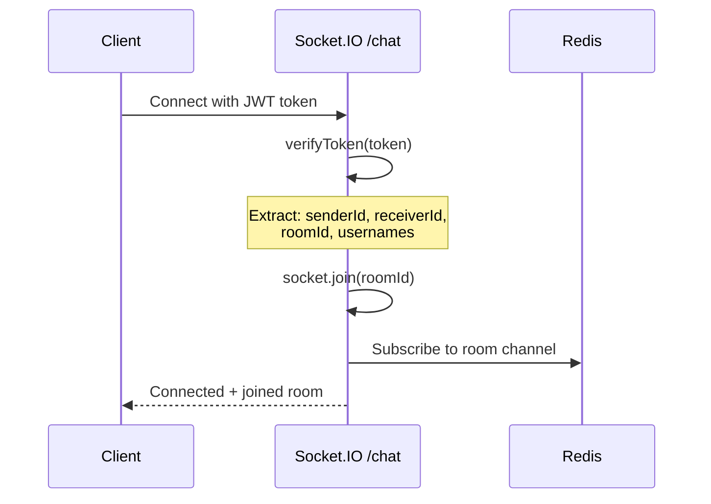
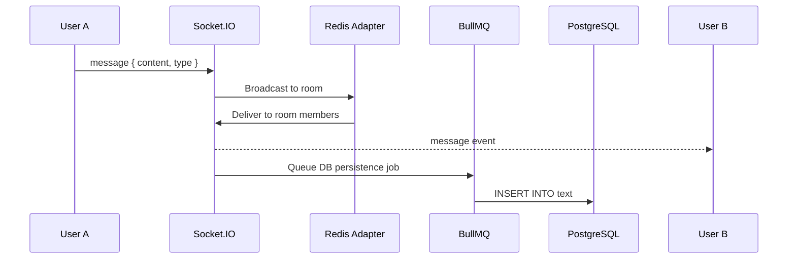
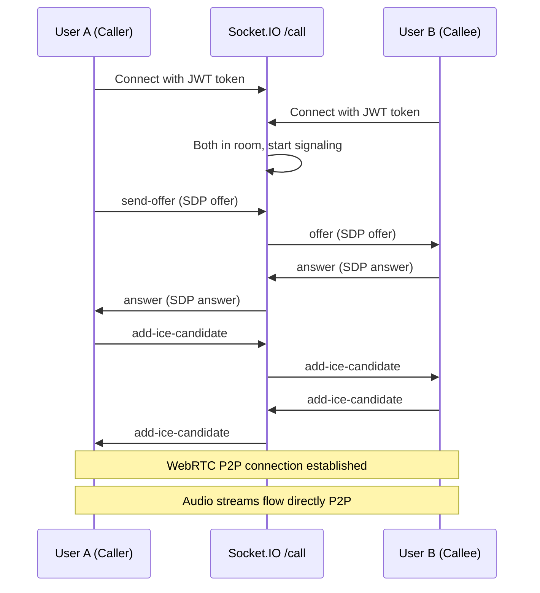
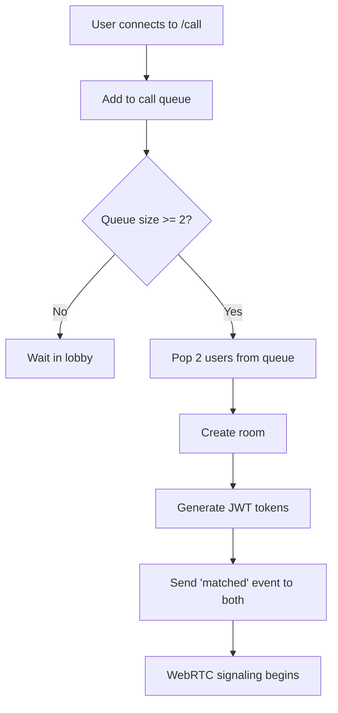
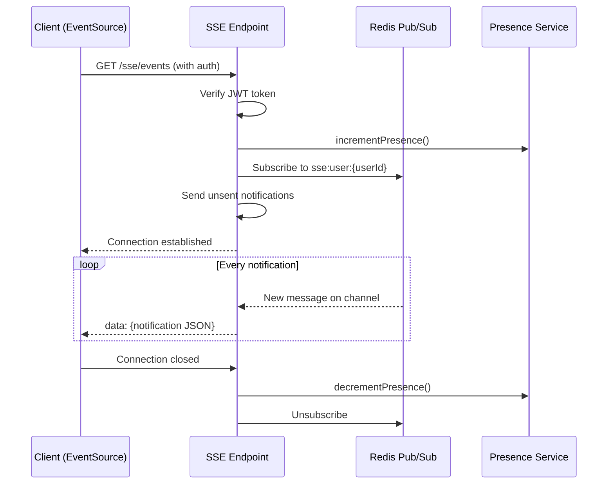
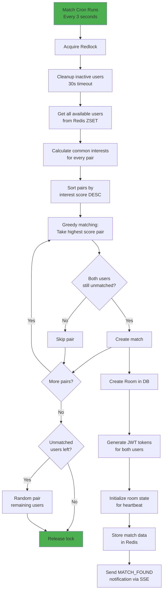
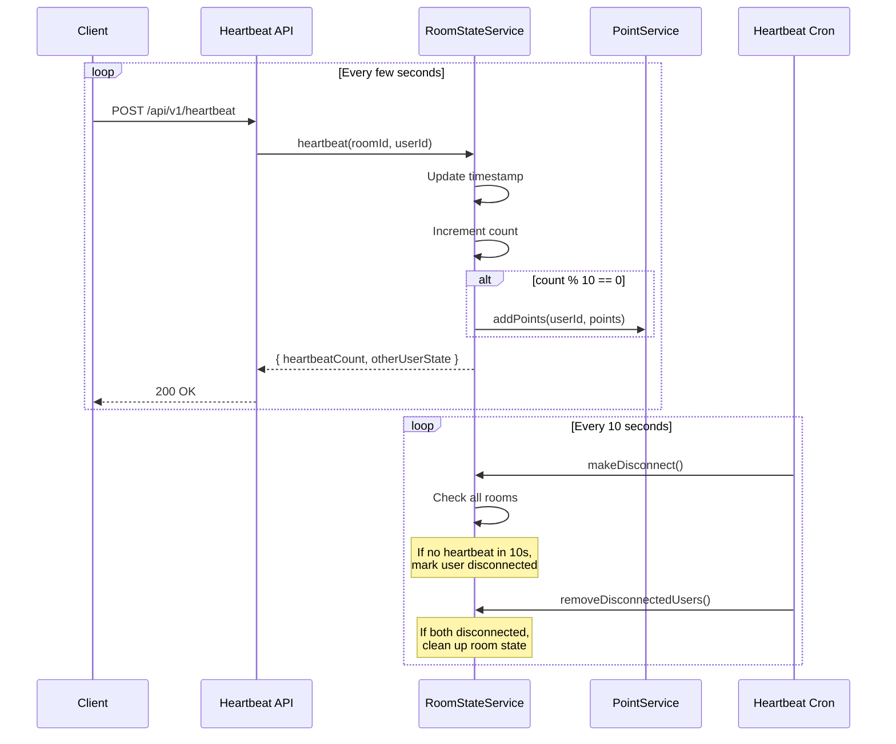
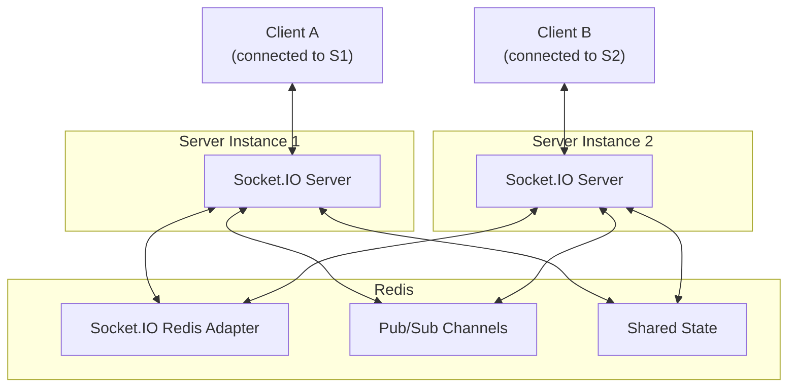

# Real-Time Communication

## Overview

Cashual uses three real-time channels:
1. **Socket.IO** — bidirectional messaging (chat namespace `/chat`, call namespace `/call`)
2. **SSE (Server-Sent Events)** — unidirectional notifications (`/sse/events`)
3. **WebRTC** — peer-to-peer audio/video (signaled via Socket.IO `/call`)

```mermaid
graph LR
    subgraph Client
        Browser
    end

    subgraph "Real-Time Channels"
        SocketChat["Socket.IO /chat<br/>Text messaging"]
        SocketCall["Socket.IO /call<br/>WebRTC signaling"]
        SSE["SSE /sse/events<br/>Notifications"]
        WebRTC["WebRTC P2P<br/>Audio/Video"]
    end

    Browser <-->|bidirectional| SocketChat
    Browser <-->|bidirectional| SocketCall
    Browser <--|unidirectional| SSE
    Browser <-->|peer-to-peer| WebRTC

    SocketChat <--> Redis
    SocketCall <--> Redis
    SSE <-- Redis
```

---

## Socket.IO Chat Namespace (`/chat`)

### Connection



**Authentication**: JWT token in connection auth header containing `senderId`, `receiverId`, `roomId`, `senderUsername`, `receiverUsername`.

### Events

#### Client → Server

| Event | Payload | Description |
|-------|---------|-------------|
| `join` | — | Join the room (auto-called on connect) |
| `leave` | — | Leave the room |
| `message` | `{ content, type, replyTo? }` | Send a message (text/image/gif/audio/video/file) |
| `user-event` | `{ eventType }` | Typing indicators and user actions |
| `call-request` | — | Request a voice call with chat partner |
| `call-request-accepted` | — | Accept incoming call request |
| `call-request-rejected` | — | Reject incoming call request |
| `emit_to_room` | `{ event, data }` | Emit custom event to other users in room |
| `broadcast_to_room` | `{ event, data }` | Broadcast custom event to all in room |

#### Server → Client

| Event | Payload | Description |
|-------|---------|-------------|
| `message` | `Message` | New message in room |
| `user-joined` | `{ userId, username }` | User joined the room |
| `user-left` | `{ userId, username }` | User left the room |
| `user-event` | `{ eventType, userId }` | User typing/action indicator |
| `call-request` | `{ from }` | Incoming call request |
| `call-request-accepted` | — | Call request accepted |
| `call-request-rejected` | — | Call request rejected |
| `friend-request` | `{ from }` | Friend request during chat |

### Message Flow



---

## Socket.IO Call Namespace (`/call`)

### Connection & WebRTC Signaling



### Events

#### Client → Server

| Event | Payload | Description |
|-------|---------|-------------|
| `send-offer` | `{ sdp }` | WebRTC SDP offer |
| `answer` | `{ sdp }` | WebRTC SDP answer |
| `add-ice-candidate` | `{ candidate }` | ICE candidate for NAT traversal |
| `user-event` | `{ eventType, data }` | Custom user events |
| `friend-request` | `{ to }` | Send friend request during call |
| `lobby` | — | Enter waiting queue |

#### Server → Client

| Event | Payload | Description |
|-------|---------|-------------|
| `offer` | `{ sdp }` | Forwarded SDP offer |
| `answer` | `{ sdp }` | Forwarded SDP answer |
| `add-ice-candidate` | `{ candidate }` | Forwarded ICE candidate |
| `user-event` | `{ eventType, data }` | Custom user events |
| `friend-request` | `{ from }` | Friend request notification |
| `matched` | `{ roomId, token }` | Paired with another user |

### Call User Manager

The call namespace uses a queue-based matching system:



---

## Server-Sent Events (`/sse/events`)

### Connection



### Event Format

```
event: notification
data: {"id":"uuid","type":"MATCH_FOUND","title":"Match Found!","message":"You've been matched","data":{"roomId":"...","token":"..."},"priority":"NORMAL"}

event: notification
data: {"id":"uuid","type":"FRIEND_REQUEST","title":"Friend Request","message":"user123 wants to be friends","data":{"from":"user123","friendshipId":"..."},"priority":"NORMAL"}
```

### Notification Types

| Type | Trigger | Client Action |
|------|---------|---------------|
| `MATCH_FOUND` | Match cron pairs users | Redirect to `/chat` or `/call` |
| `FRIEND_REQUEST` | User sends friend request | Toast + refetch friendships |
| `FRIEND_ACCEPTED` | Friend request accepted | Toast notification |
| `NEW_MESSAGE` | Direct chat request | Alert with accept/decline |
| `CALL_INCOMING` | Friend initiates call | Incoming call dialog |
| `CALL_MISSED` | Call not answered | Toast notification |
| `SYSTEM_ANNOUNCEMENT` | Admin broadcast | Alert modal |
| `POINTS_EARNED` | Points awarded | Toast notification |
| `ACHIEVEMENT_UNLOCKED` | Achievement earned | Toast notification |
| `SUBSCRIPTION_EXPIRING` | Pro expiring soon | Warning toast |
| `SUBSCRIPTION_EXPIRED` | Pro expired | Warning toast |

### Reconnection Strategy

The SSE client implements:
1. **Auto-reconnect** with exponential backoff
2. **Visibility API** — pauses when tab is hidden
3. **Heartbeat checking** — detects stale connections
4. **Last event ID** — resumes from last received event

---

## Matching Algorithm



### Anti-Spam Protection

- **7-second cooldown**: Same pair cannot be matched within 7 seconds
- **30-second timeout**: Inactive users removed from pool
- **Distributed lock**: Only one server instance runs matching at a time

---

## Heartbeat System



### Points Awarded

Points are awarded every 10 heartbeats (~30-50 seconds of activity):
- Points vary by room type (chat vs call)
- Tracked in `PointActivity` table
- Contribute to daily leaderboard

---

## Horizontal Scaling



Socket.IO uses the Redis adapter, so messages sent by a client connected to Instance 1 are automatically forwarded to clients on Instance 2 via Redis pub/sub.
